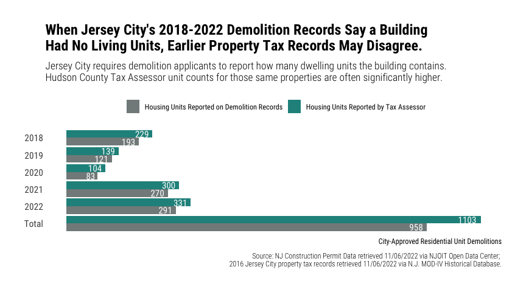
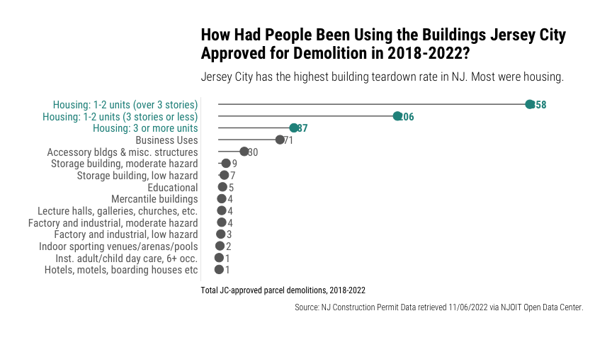
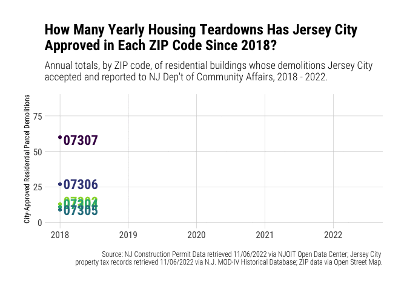
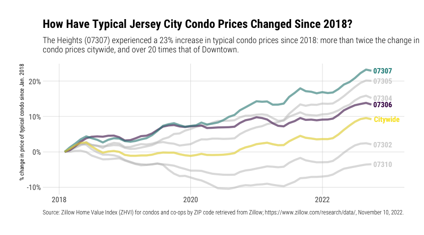

Jersey City Demolitions 2018-2022: Part II
================

Sarah Ligon ([@ligonish](https://github.com/ligonish))  
November 6, 2022

In the middle of 2022 — the same year Jersey City reported [demolishing
more housing units than any municipality in New
Jersey](https://www.nj.gov/dca/divisions/codes/reporter/2021yearly/DEMO_21.pdf)
— the *New York Times* declared it “the [most expensive city in which to
rent a home in the United
States](https://www.nytimes.com/2022/07/28/realestate/which-city-is-most-expensive-for-renters-you-might-be-surprised.html)”.

This second installment in a three-part series, originally written for
Lucy Block & Oksana Miranova’s “Spatial Analysis & Data Visualization”
grad course at NYU, investigates patterns in the housing demolitions
Jersey City administrators have approved in the five years since New
Jersey began digitizing municipal construction permit records.

Full write-up of this analysis appears in [“Whose House is Jersey City
Tearing Down? Part 2 of
3”.](https://medium.com/@srligon/whose-house-is-jersey-city-tearing-down-part-ii-3212b1514d6f)

See also [Part
1](https://medium.com/@srligon/whose-house-is-jersey-city-tearing-down-c1092cdbbc43)
& [Part
3](https://medium.com/@srligon/whose-house-is-jersey-city-tearing-down-903cdeaa6c6a).

### Data Sources

- [NJOIT Open Data Center, NJ Construction Permit
  Data](https://data.nj.gov/Reference-Data/NJ-Construction-Permit-Data/w9se-dmra)
- [Rutgers University + NJ Dep’t of Community Affairs, N.J. MOD-IV
  Historical Database](http://modiv.rutgers.edu) (See “documentation”
  folder for detailed variable descriptions)
- [2018 International Building Code, New Jersey
  Edition](https://codes.iccsafe.org/content/NJBC2018P2/chapter-3-occupancy-classification-and-use#NJBC2018P2_Ch03_Sec310)
- [Zillow Home Value Index (ZHVI) Condo/Co-op
  Timeseries](https://www.zillow.com/research/data/), by ZIP
- [OpenStreetMap](https://www.openstreetmap.org) geolocation via
  [tidygeocoder](https://cran.r-project.org/web/packages/tidygeocoder/index.html)

### Dependent Libraries

``` r
library(tidyverse)   # data cleaning & manipulation
library(janitor)     # data cleaning & easy table percentages
library(lubridate)   # date variable normalization
library(viridis)     # plot color schemes
library(hrbrthemes)  # more plot aesthetics    
library(gghighlight) # coloring specific features of line graphs
library(gganimate)   # Fun With Headaches    
```

### Loading Jersey City Demolitions Data

NJ.gov’s Open Data portal updates its construction dataset biweekly. The
latest numbers are accessible via API, but require a unique user token
to access. Here’s the code I’m using to grab updates directly —

``` r
library(RSocrata)

rm(url <- "https://data.nj.gov/resource/w9se-dmra.json?TreasuryCode=0906&Permit Type=13"

raw_jc_demos <- read.socrata(url = url, app_token = token) 
```

— but for replicability, I’ve included the same data (current as of
November 06, 2022) as a more directly accessible .csv:

``` r
jc_raw <- read_csv("data/jc_raw_2022_11_06.csv") %>% 
  clean_names
```

I cleaned this up by selecting the variables we’ll use in our analysis
and recoding the residential use descriptors to align with NJ’s 2018
International Building Code (rather than leaving them labelled merely
“International residential use code”). See this useful breakdown of
finer technical distinctions between R-3 and R-5 in NJ; it’s useful to
note that buildings with 1-2 residential units that are more than 3
stories typically aren’t enormous brownstones, but rather smaller
apartments located over a street-level shop.

I also cleaned up the block_lot record identifier to allow easier
geocoding down the line; in the raw data, lots were often stored with
decimal-value suffixes, which we separate out here to more closely
pinpoint merges with other parcel-based datasets.

To enable demolition record counts by year, I added a variable whose
value is the most recent year each record received its latest
green-light from the city (whether that came in the form of a permit or
a certificate of approval).

``` r
jc_demos <- jc_raw %>% 
  select(recordid,
         block, 
         lot,
         permitstatusdesc,
         permitdate,
         certdate,
         permittypedesc,
         certtypedesc,
         certcount,
         buildfee,
         plumbfee,
         electfee,
         firefee,
         dcafee,
         certfee,
         elevfee,
         otherfee,
         totalfee,
         constcost,
         salegained,
         rentgained,
         usegroup,
         usegroupdesc,
         processdate) %>% 
  mutate(
    lot_ext = str_extract(lot, "(?<=\\.)[:digit:]+"),
    lot = case_when(
      is.na(lot_ext) ~ lot,
      lot_ext > 0 ~ str_extract(lot, "[:digit:]+(?=\\.?)")),
    block_lot = paste0(block, "_", lot),
    ibcnj_use_desc = case_when(
      usegroup == "R-1" ~ "Hotels, motels, boarding houses etc",
      usegroup == "R-2" ~ "3 or more units",
      usegroup == "R-3" ~ "1-2 units, >3 stories",
      usegroup == "R-5" ~ "1-2 units, <= 3 stories"
      ),
    permitdate = date(permitdate),
    certdate = date(certdate),
    last_pc_year = case_when(
      certdate > permitdate ~ year(certdate),  # signoff yr
      permitdate >= certdate | is.na(certdate) ~ year(permitdate)
    )) %>% 
  relocate(lot_ext, block_lot, .after = lot)
```

That’s about as far as we got in Part I – we’re just seeing it above in
R format rather than relying on Google Sheets.

### Bring In Tax Data

Now that we’re using R, however, we can add a crucial next step: the
street address of each demolished parcel, and the actual number of
dwelling units it was assessed as containing in tax year just before our
2017 - present set begins. I chose 2016 as a close-but-not-overlapping
index property tax year. These records are not available through the
Hudson County Tax Assessor website, but can be downloaded with a free
login from the State of New Jersey and Rutgers University’s property tax
record archive. I’ll import a pre-downloaded .csv of all Jersey City
parcel records from the 2016 tax year.

``` r
mod_iv_2016 <- read_csv("data/mod_iv_data_2016_jc.csv") %>%     #61,595 obs 
  clean_names() 
```

Cleaning the tax data similarly to the process followed for demolition
data, since we’ll be cross-referencing the two sets:

``` r
mod_iv_2016 <- mod_iv_2016 %>% 
  select(
    property_id_blk,
    property_id_lot,
    property_id_qualifier,
    qualification_code_name,
    property_class,
    property_class_code_name,
    property_location,
    building_description,
    land_description,
    zoning,
    owner_name,
    number_of_owners,
    deed_date_mmddyy,
    sale_price,
    number_of_dwellings
    ) %>% 
  mutate(property_id_lot = as.character(property_id_lot),
         lot_ext = str_extract(property_id_lot, "(?<=\\.)[:digit:]+"),
         property_id_lot = case_when(
           is.na(lot_ext) ~ property_id_lot,
           lot_ext > 0 ~ str_extract(property_id_lot, "[:digit:]+(?=\\.?)")),
         block_lot = paste0(property_id_blk, "_", property_id_lot),
         number_of_dwellings = as.integer(number_of_dwellings)
         ) %>% 
  relocate(lot_ext, block_lot, .after = property_id_lot)
```

I ran a quick check for duplicates or odd records before merging
address, building description, and dwelling unit counts into each
demolition record:

``` r
merge_test <- anti_join(jc_demos, mod_iv_2016, by="block_lot") 
    # none of these are residential properties
    # 13002_4 was entered incorrectly; tax data shows it was a vacant lot since at least the 90s.
```

Merge tax data into demo data to capture street address, building
descriptions, basic owner entity information, and residential unit
counts for each parcel:

``` r
tax_demo_merge <- jc_demos %>% 
  left_join(mod_iv_2016, by = "block_lot") %>%
  arrange(recordid) %>% 
  filter(recordid!=lag(recordid) | is.na(lag(recordid))) 
```

Check for duplicates

``` r
merge_dupes <- get_dupes(tax_demo_merge, block_lot)  # all good!
```

Isolate residential demos, first by pulling all records that Jersey City
demolition reports labelled as residential usegroups:

``` r
jc_res_demos <- tax_demo_merge %>% 
  filter(str_starts(usegroup, 'R'))
```

But since these are messy sets, I went a step farther and checked for
possibly mis-recorded residential demos (where a given parcel’s use is
labelled non-residential on demolition reports, but tax records for the
same parcel label it as containing some non-zero count of dwelling
units.)

``` r
poss_res_demos <- tax_demo_merge %>%
  filter(! str_starts(usegroup, 'R')) %>%
  filter(! is.na(number_of_dwellings)) %>% 
  filter(property_class_code_name == "Residential")
# 19 aren't listed as res demo, but tax set says they contain housing units
```

I added these into our main working residential demolition set.

Time to make some unit estimates. Jersey City demolition applications
only record the number of for-sale units projected lost and the number
of rental units projected lost; in most cases, the same value is also
double-entered in both columns, making it impossible to sum either
variable (in other words, a two-bedroom house whose tax records list it
as a two-bedroom house is usually entered by Jersey City as a demolition
resulting in -2 sales units *and* -2 rental units, which would wrongly
give a total of 4 units lost, even though only 2 units total were
demolished.)

To counter this, I wrote a series of if/else statements telling R to
make two demolished-unit estimates: the first, a conservative count of
demo-reported units (using the demo records’ reported count if sales and
rental units report different values; if values were identical, I used
only one of them. Buildings reporting zeroes for all residential units
were left with zeroes.)

For a separate, slightly more accurate unit estimate, in cases where
demolition records claimed a parcel contained zero dwelling units of any
kind, but tax records listed the parcel with a non-zero number of
dwelling units, I imputed the number of tax-assessed dwelling units in
place of the zero value.

``` r
jc_res_demos <- jc_res_demos %>% 
  rows_append(poss_res_demos) %>% 
  mutate(described_units = as.integer(str_extract(building_description, pattern = "[:digit:]+(?=U)"))) %>% 
  mutate(salegained = abs(salegained),
         rentgained = abs(rentgained)) %>%
  mutate(declared_loss= case_when(
    salegained != rentgained ~ salegained + rentgained,
    salegained == rentgained & salegained != 0 ~ salegained,
    salegained + rentgained == 0 ~ 0)) %>%  
  mutate(unit_estimate = ifelse(declared_loss == 0, described_units, declared_loss))
```

Here’s a summary of unit count estimates based on from demo records, tax
assessor building descriptions, and the conservative estimate using the
former but imputing the latter where zero units were claimed demolished:

``` r
unit_counts <- jc_res_demos %>% 
  group_by(last_pc_year) %>%
  filter(last_pc_year > 2017) %>% 
  summarise(sale = sum(salegained, na.rm = T),
            rent = sum(rentgained, na.rm = T),
            declared = sum(declared_loss, na.rm = T),
            described = sum(described_units, na.rm = T),
            estimate = sum(unit_estimate, na.rm = T)) %>% 
  adorn_totals()
```

### Where Are All These Parcels?

Now we have street addresses, but no information that would let us make
some broad-strokes initial forays into how residential demolitions were
clustered by neighborhood. The NJ tax dataset we merged provides parcels
with a street and building number, but does not include ZIP codes. To
get those, along with latitude and longitude pinpoints for mapping in
Part 3, I reverse-geolocated each parcel’s street address to test out
the relatively new tidygeocoder() package. This was a s l o o o w
process, so I’ll upload the location data as a .csv below; code included
here for replication purposes.

``` r
library(tidygeocoder)

city <- "Jersey City"
state <- "NJ"

testset <- jc_res_demos %>% 
  select(block_lot, property_location) %>% 
  mutate(city = city,
         state = state)

clean_test <- testset %>% 
  mutate(norm_address = normal_address(property_location),
         norm_city = normal_city(city),
         norm_state = normal_state(state),
         .keep = "unused")%>% 
  geocode(street = norm_address,
          city = norm_city,
          state = norm_state,
          method = "osm")

rev_test <- clean_test %>% 
  reverse_geocode(lat = lat,
                  long = long,
                  address = norm_address,
                  method = "osm",
                  full_results = TRUE)

location_data <- rev_test %>% select(block_lot, postcode, lat, long)

write_csv(location_data, "jc_res_demos_coords_zips_11_07_2022.csv")
```

Instead, we’ll just upload that .csv directly:

``` r
location_data <- read_csv("data/jc_res_demos_coords_zips_11_07_2022.csv")
```

And stick the location data onto our parcel demolition records, removing
nine duplicates that resulted from the merge by telling R to keep only
distinct record IDs:

``` r
jc_res_demos <- jc_res_demos %>% 
  left_join(location_data, by = "block_lot")%>%
  relocate(property_location, postcode, lat, long, .after = block_lot) %>%
  arrange(recordid) %>%
  filter(recordid!=lag(recordid) | is.na(lag(recordid))) %>% 
  mutate(postcode = replace(postcode, postcode == "08016", "07304"))
```

### Visualizations

Now that we have tax-assessed dwelling unit counts, we can highlight
some significant possible discrepancies (possible, significant
discrepancies?) between the housing-unit counts listed in each
demolition record and those recorded on the same parcel’s property tax
records.

#### Plot 1

``` r
unit_counts %>%
  select(last_pc_year, declared, estimate) %>% 
  pivot_longer(2:3, names_to = "count_type", values_to = "units") %>%
  mutate(count_type = factor(count_type),
         last_pc_year = factor(last_pc_year)) %>% 
  ggplot(aes(fill = count_type, 
             y = units, 
             x = last_pc_year)) + 
  geom_bar(position = "dodge", 
           stat = "identity",
           show.legend = T)+
  labs (x = NULL, y = "City-Approved Residential Unit Demolitions",
        title = "When Jersey City's 2018-2022 Demolition Records Say a Building \nHad No Living Units, Earlier Property Tax Records May Disagree.",
        subtitle = "Jersey City requires demolition applicants to report how many dwelling units the building contains. \nHudson County Tax Assessor unit counts for those same properties are often significantly higher.",
        caption = "Source: NJ Construction Permit Data retrieved 11/06/2022 via NJOIT Open Data Center; \n2016 Jersey City property tax records retrieved 11/06/2022 via N.J. MOD-IV Historical Database.",
        fill = NULL)+
  geom_text(
    aes(label = units),
    color = "white",
    size = 4,
    position = position_dodge(.9),
    hjust = 1.25,
    family = "Roboto Condensed"
    )+
  scale_fill_manual(values = c("azure4", "#21918c"),
                    labels=c('Housing Units Reported on Demolition Records', 'Housing Units Reported by Tax Assessor'))+
  scale_x_discrete(limits = rev)+
  coord_flip()+
  theme_ipsum_rc(grid = FALSE)+
  theme(axis.text.x=element_blank(),
        legend.position = "top",
        )
```

<!-- -->

#### PLOT 1.b

The other thing we weren’t able to do last time was check the proportion
of all JC-approved demolitions that were residential – since we were
using Google Sheets as a primary tool, there was no way I could load a
potentially huge set of observations into a single tab. Now that we’re
using R, we can look at *all* Jersey City demolitions and examine how
people were using the buildings before they came down.

I started by cleaning up the initial demo set a bit to accommodate
visualization (those are some very, very long labels)

``` r
res_spread <- jc_demos %>% 
  mutate(usegroup = factor(usegroup)) %>%
  mutate(ibcnj_use_desc = factor(case_when(
    usegroup == "R-1" ~ "Hotels, motels, boarding houses etc",
    usegroup == "R-2" ~ "Housing: 3 or more units",
    usegroup == "R-3" ~ "Housing: 1-2 units (over 3 stories)",
    usegroup == "R-5" ~ "Housing: 1-2 units (3 stories or less)",
    usegroup == "U" ~ "Accessory bldgs & misc. structures",
    usegroup == "A-3" ~ "Lecture halls, galleries, churches, etc.",
    usegroup == "A-4" ~ "Indoor sporting venues/arenas/pools",
    usegroup == "I-4" ~ "Inst. adult/child day care, 6+ occ.",
    TRUE ~ usegroupdesc)
    )) %>% 
  group_by(ibcnj_use_desc) %>% 
  summarise(demos = n_distinct(recordid)) 
```

and then put them into a lollipop chart that is very cool/horrifying at
wide resolution, but needs retooling to be visible in smaller formats.
Another day! Meanwhile, yes: not only does JC consistently report the
most demolitions of any municipality in New Jersey, but it also appears
to be tearing down residential-use parcels almost exclusively.

``` r
res_spread %>%
  mutate(ibcnj_use_desc = fct_reorder(ibcnj_use_desc, demos)) %>% 
  ggplot(aes(x = ibcnj_use_desc, y = demos)) +
  geom_segment(aes(xend = ibcnj_use_desc, 
                   yend = 0),
               color = "dimgrey") +
  geom_point(size = 4, color = c("dimgrey", "dimgrey", "dimgrey", "dimgrey", "dimgrey", "dimgrey", "#21918c", "#21918c", "#21918c", "dimgrey", "dimgrey", "dimgrey", "dimgrey", "dimgrey", "dimgrey")) +
  labs (x = NULL,
        y = "Total JC-approved parcel demolitions, 2018-2022",
        title = "How Had People Been Using the Buildings Jersey City \nApproved for Demolition in 2018-2022?",
        subtitle = "Jersey City has the highest building teardown rate in NJ. Most were housing.",
        caption = "Source: NJ Construction Permit Data retrieved 11/06/2022 via NJOIT Open Data Center.")+
  coord_flip() +
  geom_text(aes(label = demos), 
            size = 4, 
            nudge_y = 10,
            family = "Roboto Condensed",
            fontface = c("plain", "plain", "plain", "plain", "plain", "plain", "bold", "bold", "bold", "plain", "plain", "plain", "plain", "plain", "plain"),
            color = c("dimgrey", "dimgrey", "dimgrey", "dimgrey", "dimgrey", "dimgrey", "#21918c", "#21918c", "#21918c", "dimgrey", "dimgrey", "dimgrey", "dimgrey", "dimgrey", "dimgrey")
            )+
  theme_ipsum_rc(grid = F, 
                 axis = "y",
                 axis_title_just = "l")+
  theme(axis.text.x = element_blank(),
        axis.text.y = element_text(
          color = c("dimgrey", "dimgrey", "dimgrey", "dimgrey", "dimgrey", "dimgrey", "dimgrey", "dimgrey", "dimgrey", "dimgrey", "dimgrey", "dimgrey", "#21918c", "#21918c", "#21918c")
        ))+
  expand_limits(x = 0, y = 400)
```

<!-- -->

#### PLOT 2

Jersey City ZIP codes are often used as shorthand for neighborhoods and
communities, in a way similar to NYC’s borough or subway-line
identities. Here I’m looking at total number of parcels in each ZIP
district the City approved each year (since I’m guessing there will be
some strong patterns in specific neighborhoods).

First I check how many records weren’t properly reverse-geolocated: 35
of 664. That’s small enough to add in by hand, or more likely, handle
during the geolocation section of the semester.

``` r
zip_missing <- jc_res_demos %>% 
  summarise(missing = sum(is.na(postcode))) # 35 of 664 missing 
```

You could make this plot using our main dataframe, but I’m starting with
a summary table of both parcel and unit demolitions, by ZIP and year.
The table lists both annual and cumulative totals over the five-year
period; that last variable is just for easier ggplot2 labelling.

``` r
plot_2 <- jc_res_demos %>% 
  filter(last_pc_year > 2017) %>% 
  group_by(last_pc_year, postcode) %>% 
  summarise(demos = n_distinct(recordid),
            units = sum(unit_estimate, na.rm = T)) %>%
  ungroup() %>% 
  group_by(postcode) %>%
  arrange(last_pc_year, postcode) %>% 
  mutate(cumulative_demos = cumsum(demos),
         plot_2_labs = case_when(last_pc_year == 2022 ~ paste0(cumulative_demos, " in ", postcode, " since 2018."))) 
```

Cumulative unit demolition totals, by ZIP, 2018-2022:

``` r
plot_2 %>% 
  filter(postcode != "NA",
         postcode != "07310",
         postcode != "07087") %>% 
  ggplot(aes(x = last_pc_year, 
             y = cumulative_demos, 
             group = postcode, 
             color = postcode))+
  geom_line(size = 1.5,
            alpha = .6)+
  labs (x = NULL, y = "Total City-Approved Residential Parcel Demolitions",
        title = "How Many Housing Teardowns Has Jersey City Approved \nin Each ZIP Code Since 2018?",
        subtitle = "Cumulative total residential buildings whose demolitions Jersey City accepted and \nreported to the NJ Dep't of Community Affairs, Jan. 2018 - Sept. 2022.",
        caption = "Source: NJ Construction Permit Data retrieved 11/06/2022 via NJOIT Open Data Center; Jersey City \nproperty tax records retrieved 11/06/2022 via N.J. MOD-IV Historical Database; ZIP data via Open Street Map.")+
  geom_text(aes(label = plot_2_labs,
                y = cumulative_demos,
                color = postcode),
            hjust=-.07,
            family = "Roboto Condensed",
            fontface = "bold",
            size = 4,
            nudge_y = c(-7, 20, 0, 0, -5)) +
  scale_color_viridis(discrete = TRUE, end = .8, direction = -1) +
  expand_limits(x = c(2018, 2024))+
  guides(color = "none")+
  theme_ipsum_rc(grid = F, subtitle_size = 12)+
  theme(plot.caption = element_text(hjust = 0),
        axis.text.x = element_text(color = c("black", "black", "black", "white")))
```

<!-- -->

I wanted to see what this looked like using discrete annual totals
rather than a rolling cumulative sum, but since we already tried one
version of this graph, I tired out animating the yearly-total version.

``` r
plot_2 %>% 
  filter(postcode != "NA",
         postcode != "07310",
         postcode != "07087") %>%
  ggplot(aes(x = last_pc_year, 
             y = demos, 
             group = postcode, 
             color = postcode))+
  geom_line(size = 1.5,
            alpha = .7)+
  geom_point(aes(group = postcode)) +
  labs (x = NULL, y = "City-Approved Residential Parcel Demolitions",
        title = "How Many Yearly Housing Teardowns Has Jersey City \nApproved in Each ZIP Code Since 2018?",
        subtitle = "Annual totals, by ZIP code, of residential buildings whose demolitions Jersey City \naccepted and reported to NJ Dep't of Community Affairs, 2018 - 2022.",
        caption = "Source: NJ Construction Permit Data retrieved 11/06/2022 via NJOIT Open Data Center; Jersey City \nproperty tax records retrieved 11/06/2022 via N.J. MOD-IV Historical Database; ZIP data via Open Street Map.")+
  geom_text(aes(label = postcode,
                y = demos,
                color = postcode),
            hjust=-.1,
            family = "Roboto Condensed",
            fontface = "bold",
            size = 6,
            nudge_y = c(2, 2, 0, 0, -2)) +
  theme(plot.caption = element_text(hjust = 0))+
  expand_limits(x = c(2018, 2022.5))+
  scale_color_viridis(discrete = TRUE, end = .85, direction = -1) +
  guides(colour = "none") +
  theme_ipsum_rc(grid = "XY")+
  transition_reveal(last_pc_year) +
  ease_aes('cubic-in-out')
```

<!-- -->

``` r
anim_save("plots/plot_2_annual_animated.gif")
```

#### Plot 3

Here’s a summary-table df setting up total parcels demolished in each
ZIP code.

``` r
plot_3 <- jc_res_demos %>% 
  filter(last_pc_year > 2017) %>% 
  mutate(postcode = factor(postcode)) %>% 
  group_by(postcode) %>% 
  summarise(demos = n_distinct(recordid),
            units = sum(unit_estimate, na.rm = T))
```

Plot 3

``` r
plot_3 %>%
  filter(postcode != "NA",
         postcode != "07087") %>% 
  mutate(postcode = fct_reorder(postcode, units)) %>% 
  ggplot(aes(x=postcode, y=units)) +
  geom_segment(aes(xend=postcode, yend=0)) +
  geom_point(size = 6, color = "#35b779") +
  geom_text(
    aes(label = units),
    color = "black",
    size = 4,
    nudge_y = 15,
    family = "Roboto Condensed",
    fontface = "bold"
  )+
  labs (x = "ZIP Code",
        y = "Estimated residential units approved for demolition by City of Jersey City, 2018-2022",
        title = "The Heights Lost the Most Housing Units to City-Approved Demolitions.",
        subtitle = "Journal Square and the West Side weren't far behind. Waterfront ZIPs lost the fewest units over the last five years.",
        caption = "Source: NJ Construction Permit Data retrieved 11/06/2022 via NJOIT Open Data Center; Jersey City \nproperty tax records retrieved 11/06/2022 via N.J. MOD-IV Historical Database.")+
  coord_flip() +
  theme_ipsum_rc(axis = "x", grid = F) 
```

<!-- -->

So we’re at 481 lines of code, and it’s time to write this up rather
than bringing in even more … lines of code? – but our work here and on
Google Street View histories of these buildings, along with anecdotal
trends in the greater NYC area, suggest a big proportion of condo
conversions. I’m going to explore filling in stronger connections
between demolitions, condo conversions or other lot flips (including
City-sponsored 60s-esque “urban renewal”, which tragically is still very
much in full swing here) later in this project. (Though making that
connection would really require some robust statistical modelling beyond
our scope in this class.) Meanwhile, after seeing the breakdown of
demolished units in specific ZIP codes (especially 07307) above, I’m
curious about how the housing market might have reacted in those ZIPs
during that same time period.

#### In Which We Don’t Need Another Plot, But Do We Want One?

To get a sense of whether there’s something there, I downloaded Zillow’s
“typical condo price” estimates by ZIP code and isolated them to Jersey
City’s. These are problematic data on many levels, but they’re something
to go on for now.

``` r
# Isolate JC-only ZIP codes, including 07087, which overlaps w/ Union City & thus wasn't included under city name in Zillow set

zillow_jc <- read_csv("data/City_zhvi_uc_condo_tier_0.33_0.67_sm_sa_month.csv") %>% 
  clean_names() %>%
  filter(region_name == "Jersey City") %>% 
  select(region_name, x2018_01_31:x2022_09_30)

zillow_zips <- read_csv("data/Zip_zhvi_uc_condo_tier_0.33_0.67_sm_sa_month.csv") %>% 
  clean_names() %>% 
  filter(city == "Jersey City" | region_name == "07087") %>% 
  select(region_name, x2018_01_31:x2022_09_30) %>% 
  rows_append(zillow_jc)
```

Reshaped and lubridated. I’m also adding a change-since-baseline delta
variable showing the percentage increase or decrease in each ZIP code’s
typical condo prices over the last 5 years.

``` r
zillow_zips <- zillow_zips %>%
  mutate(jan_2018_baseline = x2018_01_31) %>% 
  pivot_longer(2:58, 
               names_to = "date", 
               values_to = "zillow_typical_condo_value") %>%
  rename(zip = region_name) %>% 
  mutate(date = str_replace(date, "x", ""),
         date = ymd(date),
         zip = replace(zip, zip == "Jersey City", "Citywide"),
         #pct_change_since_jan_2018 = round((((zillow_typical_condo_value - jan_2018_baseline)/jan_2018_baseline)*100),2),
         pct_change_since_jan_2018 = (((zillow_typical_condo_value - jan_2018_baseline)/jan_2018_baseline)),
         zip_labels = case_when(date == "2022-09-30" & zip != "Jersey City" ~ zip,
                                TRUE ~ NA_character_)
         ) %>% 
  relocate(jan_2018_baseline, .before = pct_change_since_jan_2018)
```

And now we can look at it! Since there are so many lines, I’m using the
gghighlight package to keep this from looking like a colorful plate of
spaghetti. Interestingly, the non-Waterfront ZIP codes’ condo prices are
the ones hurtling up the fastest since 2018 (likely because available
Waterfront housing stock was bought up and flipped by Australian real
estate/superfund megaforce Dixon Advisory c. 2014-15, before demolition
records became available in NJ.) Causality could flow either way, here,
but the demolition rate and condo price spikes do suggest some sort of
correlation.

``` r
zillow_zips %>%
  filter(zip != "07087") %>%
  ggplot(aes(x = date, 
             y = pct_change_since_jan_2018, 
             group = zip, 
             color = zip)
         )+
  geom_line(size = 1.5, alpha = .5)+
  labs (x = NULL, y = "% change in price of typical condo since Jan. 2018",
        title = "How Have Typical Jersey City Condo Prices Changed Since 2018?",
        subtitle = "The Heights (07307) experienced a 23% increase in typical condo prices since 2018: more than twice the change in \ncondo prices citywide, and over 20 times that of Downtown.",
        caption = "Source: Zillow Home Value Index (ZHVI) for condos and co-ops by ZIP code retrieved from Zillow; https://www.zillow.com/research/data/, November 10, 2022.")+
  geom_text(aes(label = zip_labels,
                x = date + 0.6,
                y = pct_change_since_jan_2018,
                color = zip),
            hjust=-.1,
            family = "Roboto Condensed",
            fontface = "bold",
            size = 4) +
  gghighlight(zip == "07307" | zip == "07306" | zip == "Citywide", 
              use_direct_label = FALSE) +
  scale_color_viridis_d()+
  guides(color = "none")+
  scale_y_continuous(labels = scales::percent)+
  scale_x_date(date_labels = "%Y", limit=c(as.Date("2018-01-01"),as.Date("2022-12-31")))+
  theme_ipsum_rc(grid = "XY")+
  theme(plot.caption = element_text(hjust = 0))
```

<!-- -->
